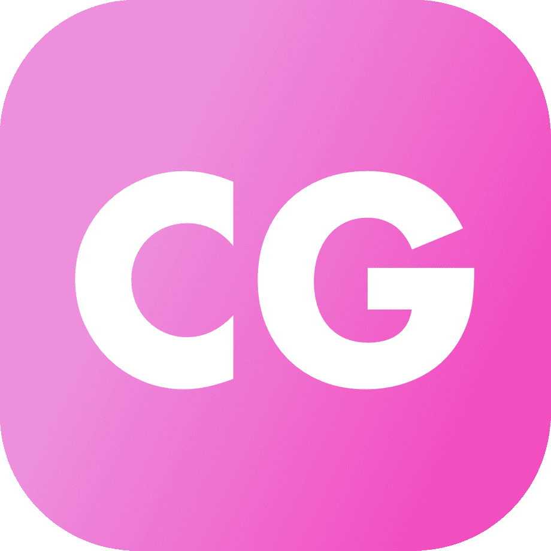

<h1 align="center">前端创意中心</h1>

  

- [免费试听课录播](#免费试听课录播)
- [课程概要](#课程概要)
- [上课时间](#上课时间)
- [课前作业](#课前作业)
- [FAQ](#FAQ)
- [参考代码](#参考代码)
- [补充资料](#补充资料)

# 免费试听课录播
- [Zoom 链接🔗](https://ubc.zoom.us/rec/share/lG-LBScxs8MUVViD9xi0vSURBVY8eSMqZoMVw9-OsZBODwXGsMtfBOX_gqssyE_r.B_W6K6I6L1mLk1An)
- Access Passcode: brG&+K6?

# 课程概要

  

# 上课时间

| 课次        | 温哥华时间      | 北京时间        | 内容简介                                                     |
| ----------- | --------------- | --------------- | ------------------------------------------------------------ |
| 免费试听课  | 8.1 6PM - 10PM  | 8.2 9AM - 1PM   | - 软件工程是什么  - 为什么学前端  - 环境配置  - 3个 projects 效果预览  - Git 版本控制  - HTML/CSS 入门  - JavaScript/Typescript 入门  - Bonus project: MVC Todo List  - 代码风格/最佳实践 |
| 基础课1     | 8.15 6PM - 10PM | 8.16 9AM - 1PM  | - HTML/CSS/JavaScript 进阶  - 继续 MVC Todo List: 完成 JavaScript  - Project 1: Adidas 商品展示页  - MVC Todo List: 加入 TypeScript |
| office hour | 8.22 6PM - 8PM  | 8.23 9AM - 11AM | - 一对一答疑 - 前两节课知识点巩固                        |
| 基础课2     | 8.29 6PM - 10PM | 8.30 9AM - 1PM  | - Project 2: 星球大战商品展示页 - React 入门  - Bonus Project: React TypeScript Todo List - 工具链：包管理/编译/构建/持续集成 - Project 3.0: 搭建环境+基础架构 |
| 进阶课1     | 9.12 6PM - 10PM | 9.13 9AM - 1PM  | - React 进阶（包含 hooks） - Project 3.0: 公共组件+工具函数 - Project 3.1: macOS 桌面+任务栏  - CSS 衍生语言: SCSS |
| 进阶课2     | 9.19 6PM - 10PM | 9.20 9AM - 1PM  | - React 进阶（2020/2021 新特性） - Project 3.2: macOS 计算器  - 模块化编程 |
| 进阶课3     | 9.26 6PM - 10PM | 9.27 9AM - 1PM  | - 浏览器高级特性: Canvas 和事件监听 - Project 3.3: macOS 画板 |
| 结课仪式    | 10.3 6PM - 8PM  | 10.4 9AM - 11AM | - 持续学习: 后端/算法/数据结构/前端其他框架 - 如何把 project 运用到简历/面试中 - 优秀作品展示 |

# 课前作业

- [免费试听课](#免费试听课) - due 8.1 6PM 温哥华时间
- [基础课1](#基础课1) - due 8.15 6PM 温哥华时间
- [基础课2](#基础课2) - due 8.29 6PM 温哥华时间

## 免费试听课

- 请<ins>按照顺序</ins>完成课前准备，如有疑问，请尽量在<ins>课前</ins>问我。

- 知道如何打开 Terminal

  - [macOS Terminal](https://support.apple.com/guide/terminal/open-or-quit-terminal-apd5265185d-f365-44cb-8b09-71a064a42125/mac)
  - [Windows 10 Command Prompt](https://www.freecodecamp.org/news/how-to-open-the-command-prompt-in-windows-10/)

- 注册 [GitHub](https://github.com) 账号

- 下载 [Chrome 浏览器](https://www.google.com/chrome/)

- 下载 Git

  - [Windows](https://git-scm.com/download/win)
  - [macOS](https://git-scm.com/download/mac)

- Windows 用户：下载 [Git Bash](https://gitforwindows.org)

- 下载 [VS Code](https://code.visualstudio.com/Download)

- 下载 [Node.js 和 npm](https://nodejs.org/en/download/)（选择 LTS 下面的 Windows Installer 或 macOS Installer）

- 下载以下 VS Code 插件（[如何下载插件](https://code.visualstudio.com/docs/editor/extension-marketplace)）

  - 实在不会下载也没事，上课会讲。<ins>划线插件</ins>是必备插件，建议课前下载好。
- Auto Close Tag
  - Auto Rename Tag
- Bracket Pair Colorizer
  - Color Highlighter
- EditorConfig for VS Code
  - <ins>ESLint</ins>
- Highlight Matching Tag
  - HTML Boilerplate
- <ins>HTML CSS Support</ins>
  - Image Preview
- <ins>IntelliSense for CSS class names in HTML</ins>
  - <ins>Live Server</ins>
- Material Icon Theme
  - npm
- npm Intellisense
  - Path  
- <ins>Prettier - Code formatter</ins>
  - <ins>Prettier Now</ins>

## 基础课1

- 根据试听课录播，完成 MVC Todo List 的 HTML / CSS 部分。代码 push 到自己 fork 的 GitHub 仓库。
  - HTML代码：请理解每个 HTML tag 的作用，理解 attribute 的 作用，理解 class 和 id 的区别。
  - CSS 代码：试听课现场写的部分，大致明白就行。剩下没有现场写的部分，请大概浏览一遍，如遇到不明白/好奇的地方，请 Google 相关的 CSS 知识，MDN 和 W3Schools 都是比较好的 CSS 资料，可在搜索关键词后加上 MDN 或者 W3Schools。CSS 不必太纠结细节，查了资料不能立刻看懂的，暂时先不管。
  - 如需对照答案，可以 clone MVC Todo List 的[代码仓库](https://github.com/chuntonggao/todo-list)，通过`git checkout vanilla-js-solution`命令查看答案代码。`master`分支上是初始代码。
- 复习 git 相关操作，可参考[我的教程](https://chuntonggao.github.io/super-simple-git/)。
- 回顾 Model-View-Controller 概念，阅读`script.js`文件中的所有 comments 和 method signatures，理解 event listener 的概念。
  - 可以 clone MVC Todo List 的[代码仓库](https://github.com/chuntonggao/todo-list) 后，在`master`分支阅读，也可以在 [GitHub 网页](https://github.com/chuntonggao/todo-list/blob/master/script.js)上阅读。
- 请在 [GitHub Issue](https://github.com/chuntonggao/creativity-center/issues) 上，创建一个新 issue。issue 包含以下信息：
  - 你的 GitHub URL
  - 3个 HTML 问题（最好和试听课内容相关）
  - 3个 CSS 问题（最好和试听课内容相关）
  - 3个 JavaScript 问题（最好和试听课内容相关）

## 基础课2

- 完成 MVC Todo List，把代码 push 到自己的 GitHub 上，并以 GitHub Pages 的形式发布。
- 完成 Adidas 商品展示页，把代码 push 到自己的 GitHub 上，并以 GitHub Pages 的形式发布。注意，我课上做这个项目的时候，是在 CodePen 上做的，所以不需要在 HTML 里引入 CSS 和 JavaScript，但是如果在本地开发的话，需要引入，而且需要完成写出 HTML 的 head tag。具体参考基础课1视频的最后部分。
- 两个项目的代码，不一定要和我一摸一样。最好能做出一些和我不一样的东西，小到更换颜色和样式，大到增加新的功能，希望大家能发挥自己的创意，做一些不一样的东西。
- 请在 [GitHub Issue](https://github.com/chuntonggao/creativity-center/issues) 上，创建一个新 issue。issue 包含以下信息：
  - 你的 MVC Todo List 的 URL
  - 你的 Adidas 商品展示页的 URL
- 下载 [Node.js 和 npm](https://nodejs.org/en/download/)（选择 LTS 下面的 Windows Installer 或 macOS Installer）
- 下载完 npm 之后，通过`npm install -g npx`命令下载 npx。如果该命令因权限问题执行失败，请输入`sudo npm install -g npx`，然后会让你输入计算机密码。

# FAQ

- 课程有录播吗？

> 有录播。但是建议参加直播，直播有互动，如果有问题，可以得到实时反馈、帮助。如果时间实在排不开，可以观看录播，但是观看录播时，一定要和我一起动手写代码，有问题及时问我，把录播当成直播一样学习。

- 跟其他类似课程相比，我的课程有什么特性/优势吗？

> 首先，我的课不是传统意义上的“听老师讲课”，我的课非常强调“一起动手做”。在上课的过程中，我会让大家和我一起写代码，大家的动手编程能力会得到极大提升，同时也能收获到属于自己的编程项目。
>
> 其次，跟其他常见的 project 课相比，我的 project 都是精心挑选、设计的，不仅能让大家学习前端常见的编程理念，而且也能感受到编程的乐趣。尤其是 project 3，会在浏览器里模拟一个 macOS 操作系统，可以说是绝无仅有的镇店之宝，不管是写在简历上，还是面试中谈到，都会让人惊叹。
>
> 然后，同学们得到的帮助和服务，远不仅仅上课的几十个小时。课后做拓展作业时，如有不理解的地方，我会随时为大家解惑。我还会为大家的代码提供 code review，确保大家代码质量，模拟公司中工作的场景。
>
> 甚至完成课程后，如果需要根据 project 撰写简历或者准备面试，我也会尽可能提供帮助，为大家提供职业上的建议。我现在在 [Citi 花旗](https://en.wikipedia.org/wiki/Citibank) 工作，公司每年十月份会招聘实习生和应届生，<ins>我可以为大家提供内推</ins>。其他公司的内推也可以，我的朋友/同事遍布于各大知名公司。

- 我没有任何编程经验，我能跟上课程的节奏吗？

> 能。我的课程适用于零基础、入门级、中级选手，任何背景的人，都能从我的课中，学到自己需要的东西。对于零基础或者入门级选手，我的课会带你进入编程世界，让你不再迷茫；对于中级选手，我的课会让你对软件工程有更深的理解，逐渐成长为一名优秀的工程师。有基础的选手，请着重看下一个问题。

- 我以前有过前端编程经验，对 HTML/CSS/JavaScript 比较熟悉，请问可以跳过基础课，直接上进阶课吗？

> 可以，但是大多数情况下不建议。
>
> 1. 是真的比较熟悉（比如在大公司做过前端工程师），还是仅仅是用过？如果是后者，建议不要跳过基础课。后面的进阶课，和前面的基础课是环环相扣的，需要非常扎实的 HTML/CSS/JavaScript 基础。而且基础课讲解的，远不仅仅是 HTML/CSS/JavaScript，也会介绍 TypeScript、优秀的编程习惯和前端完整工具链。这些全都是进阶课的基础。
> 2. 免费试听课，算是基础课的前奏，大家可以来试听。试听课和基础课上，我会讲一些看似很简单，但实际上没那么简单的东西，哪怕对于接触过前端的同学，也会非常有帮助。比如，我在试听课上，会讲如何用 JavaScript 做一个 todo list。在 UBC 上过 CPSC210 的同学基本都做过类似的project，但是做出来不等于做得好，仅仅实现功能，对于一个优秀的工程师来说是远远不够的。大家以前做的 todo list，真的严格执行模块化编程了吗？真的严格遵循“高内聚、低耦合”了吗？可拓展性如何，是否能快速加入新功能？代码的可读性、可维护性如何？能否让第一次接触项目的人快速理解？ 是否有代码风格和最佳实践的检测？是否考虑到了团队合作中的代码规范问题？这些问题，我在试听课和基础课上，都会反复强调。所以，哪怕是接触过前端的同学，我也强烈建议不要跳过基础部分。

- 每个人的 Project 一样吗？

> Yes and no. 以“Project 3: 复刻 macOS“为例，每个同学都会尝试复刻 macOS。我会在课上演示基础功能的代码，并在写代码的过程中，穿插讲解相关知识点。每节课快结束的时候，我会给大家一些 ideas/inspirations，让大家课后自己写一些额外的 features，这部分额外的东西，大家是自由发挥的，所以每个人都不一样。额外 features 部分，我也会为大家提供指导和帮助。

# 参考代码
- [MVC Todo List(试听课/基础课1)](https://github.com/chuntonggao/todo-list)
# 补充资料

- [w3schools HTML/CSS/JavaScript Reference](https://www.w3schools.com)
- [MDN Web Doc](https://developer.mozilla.org/en-US/docs/Web)
